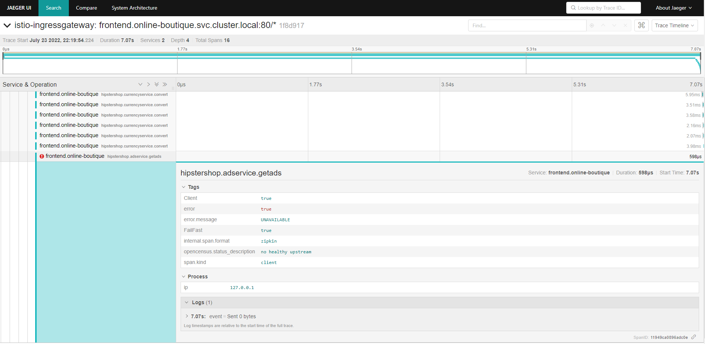

# Using Jaeger Tracing

I use a private Kubernetes cluster (__microk8s__) running on a local server.
__microk8s__' Jaeger addon is an implementation of [Jaeger Operator](https://www.jaegertracing.io/docs/1.24/operator/).

Verify Jaeger is deployed and running:
```shell
kubectl get pods -n default -l app=jaeger
NAME                       READY   STATUS    RESTARTS   AGE
simplest-df7469d58-v7rdn   1/1     Running   0          3m50s
```
```shell
kubectl get deployment jaeger-operator -n default
NAME              READY   UP-TO-DATE   AVAILABLE   AGE
jaeger-operator   1/1     1            1           161m
```
```shell
kubectl get jaeger -n default
NAME       STATUS    VERSION   STRATEGY   STORAGE   AGE
simplest   Running   1.24.0    allinone   memory    162m
```

You can now look at the Jaeger query UI by port-forwarding to the running Jaeger instance on port 16686 in your cluster
and visiting http://localhost:16686/ in your browser:
```shell
kubectl -n default port-forward $(kubectl -n default get pod -l app=jaeger --no-headers -o jsonpath='{.items[0].metadata.name}') 16686:16686
```
No traces will be visible unless we configure Istio Envoy proxies to report traces
to Jaeger instance.

### Configure Istio to report traces
Configure your mesh to send traces to the enabled Jaeger by setting the global tracing options.

Find the active Istio profile name:
```shell
kubectl get istiooperator -n istio-system -o jsonpath='{.items[0].spec.profile}'
demo
```

The current settings for `meshConfig` is:
```shell
kubectl get istiooperator -n istio-system -o jsonpath='{.items[0].spec.meshConfig}'
```
```json
{
  "accessLogFile": "/dev/stdout",
  "defaultConfig": {
    "proxyMetadata": {}
  },
  "enablePrometheusMerge": true
}
```
> On Windows run the following on a Windows command prompt.
```shell
istioctl install --set profile=demo --set meshConfig.accessLogFile=/dev/stdout --set meshConfig.accessLogEncoding=JSON --set meshConfig.defaultConfig.tracing.zipkin.address=simplest-collector-headless.default.svc:9411 -y
```
Verify the settings:

```shell
kubectl -n istio-system get configmap istio -o jsonpath='{.data.mesh}'
```
```shell
accessLogEncoding: JSON
accessLogFile: /dev/stdout
defaultConfig:
  discoveryAddress: istiod.istio-system.svc:15012
  proxyMetadata: {}
  tracing:
    zipkin:
      address: simplest-collector-headless.default.svc:9411
enablePrometheusMerge: true
rootNamespace: istio-system
trustDomain: cluster.local
```

For any tracing configuration changes to take effect, restart all gateways and workload pods with injected Envoy proxies.

Let’s begin with restarting the Istio gateway pods:
```shell
kubectl delete pod -n istio-system -l app=istio-ingressgateway
pod "istio-ingressgateway-8f568d595-h2lvt" deleted
```
```shell
kubectl delete pod -n istio-system -l app=istio-egressgateway
pod "istio-egressgateway-5547fcc8fc-cpgw4" deleted
```

Now, restart all workload pods in the online-boutique namespace with injected Envoy sidecar proxies:
```shell
kubectl -n online-boutique get pods --no-headers -o jsonpath='{.items[*].metadata.name}' | xargs kubectl -n online-boutique delete pod
```

Generate some traffic.
```shell
for i in {1..20}; do curl -sS http://$INGRESS >> /dev/null; done
```
Now you should be able to see traces available for the services. 

### Introduce a fixed delay
To understand the benefit of tracing we can introduce a bottleneck between
some services in our application. This will demonstrate how the time taken to complete
requests is being reported by Jaeger.

We can configure a VirtualService that introduces a delay for any requests
made to the product catalogue service.
```shell
kubectl apply -f monitoring/fixed-delay-virtual-service.yaml
```

Also, to get traces to span multiple microservices we use a modified version
of the `frontend` service that propagate the Zipkin headers and context to upstream
services and Jaeger.
```shell
kubectl apply -f monitoring/frontend-trace-context-propagation-update.yaml
```

Now, generate some traffic.
```shell
for i in {1..5}; do curl -sS http://$INGRESS -w "%{time_total}" -o /dev/null; echo;done
```

## <a id="milestone5"></a> Observing Errors
Scale down one of the services, the `adservice` and observe the error reported
in Jaeger.

Before scaling down the `adservice` to zero instances.
```shell
kubectl get deploy adservice -o jsonpath='{.spec.replicas}'
1
```

now, scale the pod to 0 instances
```shell
kubectl scale --replicas=0 deploy adservice
deployment.apps/adservice scaled
```

Send some traffic
```shell
for i in {1..5}; do curl -sS http://$INGRESS -w "%{time_total}" -o /dev/null; echo;done
```

and we can see the error reported by the Envoy sidecar proxies.

